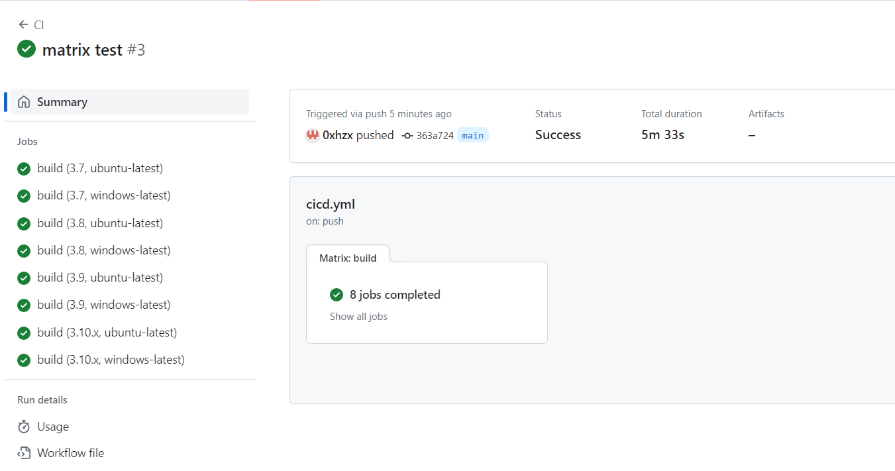

[](https://github.com/0xhzx/IDS706_w4_Devops_hzx/actions/workflows/cicd.yml)
# Template for Python projects 

## Week 4 New feature
This project is based on the basic template from week 1. Focus on GitHub Actions Matrix Build for Multiple Python Versions and OS Versions. We can found that build on Ubuntu is much quicker than Windows :) If you also need to install many python packages and test a bunch of functions, `Ubuntu` is a preferred choice.
```
Python: 
    * 3.7
    * 3.8 
    * 3.9
    * 3.10.x

OS: 
    * Ubuntu 
    * Windows
```



## IDS-706 2023 fall Week 1 Mini-project
Requirements: Demo - Create a Python GitHub template you use for the rest of class (.devcontainer, Makefile, GitHub Actions, requirements.txt, README.md)

Things included are:

* `Makefile`
    - Dependency management
    - Automated build process
    - Testing
    - Linting and code quality [pylint, flake8, or black]
    - Cleaning and maintenance
* `Pytest`
    - Just need to run `pytest` in the terminal
    - A more effective method run `make test`

* `pandas`

* `Pylint`

* `Dockerfile`

* `GitHub copilot`

* `jupyter` and `ipython` 

* A base set of libraries for devops and web

* `githubactions` 

## Reference
* [python-template by Noah Gift](https://github.com/nogibjj/python-template/tree/main)